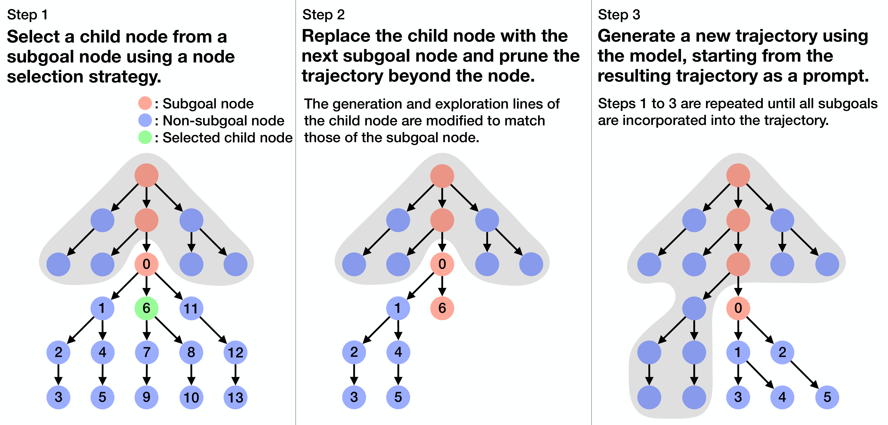

# Guided Stream of Search

This is the code for the paper [Guided Stream of Search: Learning to Better Search with Language Models via Optimal Path Guidance](https://arxiv.org/abs/2410.02992).



## Computational resources

- Training: 4 x NVIDIA A100 80GB 
- Inference: 1 x NVIDIA RTX 3090 24GB

## Prerequisite

The base directory is set to `/home/{user}/guided-stream-of-search`. All data, checkpoints, and other files will be stored under this base directory. Please update this path as needed before running the script.

## Environment settings

```bash
conda env create --name countdown --file environment.yaml
conda activate countdown
cd stream-of-search
pip install -r requirements.txt
cd ..
cd tril
pip install -e .
pip install flash-attn --no-build-isolation
```

> [!NOTE]  
> Please do not modify the package versions. Any changes may cause numerical instability as discussed in [this article](https://huggingface.co/blog/putting_rl_back_in_rlhf_with_rloo).

## Data generation

The datasets are saved in `/home/{user}/guided-stream-of-search/stream-of-search/data`.

```bash
conda activate countdown
cd stream-of-search
sh script/task/gen_task.sh  # Training
sh script/task/gen_task_final.sh  # Evaluation
```

## Unsupervised pre-training

The checkpoint is saved in `/home/{user}/guided-stream-of-search/stream-of-search/output`.

```bash
conda activate countdown
cd stream-of-search
sh script/gpt2/train_sos.sh
```

## Supervised fine-tuning with self-generated data

The data and checkpoints are saved in `/home/{user}/guided-stream-of-search/stream-of-search/output`.

```bash
conda activate countdown
cd stream-of-search

# Iteration 1
sh script/gpt2/iter1/gen_star_s0.sh
sh script/gpt2/iter1/gen_gsos_rand_s0.sh --start 0
...
sh script/gpt2/iter1/gen_gsos_rand_s0.sh --start 199000
sh script/gpt2/iter1/train_gsos_rand_s0.sh

# Iteration 2
sh script/gpt2/iter2/gen_gsos_rand_s0.sh --start 0
...
sh script/gpt2/iter2/gen_gsos_rand_s0.sh --start 199000
sh script/gpt2/iter2/train_gsos_rand_s0.sh

# Iteration 3
sh script/gpt2/iter3/gen_gsos_rand_s0.sh --start 0
...
sh script/gpt2/iter3/gen_gsos_rand_s0.sh --start 199000
sh script/gpt2/iter3/train_gsos_rand_s0.sh
```

> [!NOTE]  
> The data generation process requires a large number of GPUs. It is recommended to use over 40 NVIDIA RTX 3090 GPUs and run the scripts in parallel.

## RL fine-tuning

The checkpoint is saved in `/home/{user}/guided-stream-of-search/tril/output`.

```bash
conda activate countdown
cd tril
sh examples/countdown/countdown_ppo_op.sh
```

## Evaluation

The results are saved in the provided checkpoint directory.

### Unsupervised pre-training & supervised fine-tuning

```bash
conda activate countdown
cd stream-of-search
python eval.py --ckpt {ckpt} --start 0
...
python eval.py --ckpt {ckpt} --start 10000
cd ..
python summary.py --ckpt {ckpt}
```

### RL fine-tuning

```bash
conda activate countdown
cd tril
python eval.py --ckpt {ckpt} --start 0
...
python eval.py --ckpt {ckpt} --start 10000
cd ..
python summary.py --ckpt {ckpt}
```

## Checkpoints

Checkpoints used in the paper can be found in the following links:

- SoS: https://drive.google.com/drive/folders/1oaOYoUcNMNVIpX9MhUS6ZQWBBZPrj6cW?usp=drive_link
- SoS+STaR: https://drive.google.com/drive/folders/1uoOJGfUCDjT6CKsTdsh5m1OTFBikBMUc?usp=drive_link
- SoS+PPO: https://drive.google.com/drive/folders/1GcxQ4Z7bUFHSp8A4jhJLrT56U4Wlda2Y?usp=drive_link
- GSoS: https://drive.google.com/drive/folders/1MMeBmyFPdYVgEQFCpBDOqerLuw-JKclt?usp=drive_link
- GSoS+PPO: https://drive.google.com/drive/folders/1FttFIgHrXWIJbX5VbN5gOOEtlz03Q_ve?usp=drive_link

## Acknowledgements

This repository is built on the following repositories with some modifications. The specific changes we made are detailed in the README file of each directory.

- https://github.com/kanishkg/stream-of-search/
- https://github.com/Cornell-RL/tril
